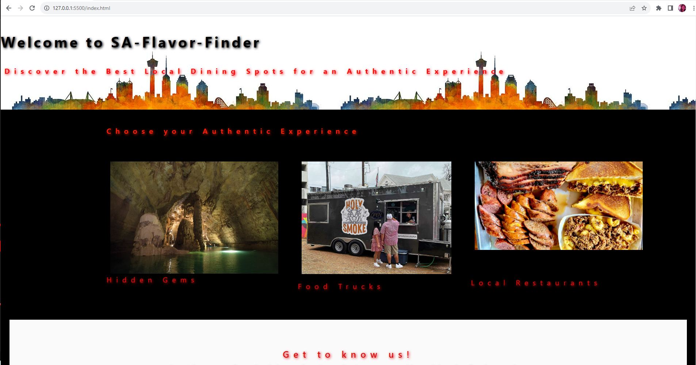

# SA-Flavor-Finder
Your Guide to Local San Antonio Restaurants and adventure

## Description
As full-stack web developers, we want to create a website that will work as a guide for tourists to get the best authentic experience in San Antonio.  Whether they are traveling solo or with family, this website will help plan their days with things to do and the best local eateries in town.

# Usage
To use this website, simply click on an image which represents the type of experience you are seeking.  There are three options to choose from:  Hidden Gems, Food Trucks, and Local Restaurants.  Once you click on the image, you will be directed to another page with different options to choose from.  The Hidden Gems page will have three categories listed with options for you to choose from.  Family fun, the great outdoors, and night life.  Under each of these categories, you will be given 3 different options to choose from.  clicking on the images will take you to the website and clicking on the activity name, will take you to the the company's social media.  Should you change your mind, simply click the reset button at the bottom of the page to take you back to the main page.  The food truck and local restaurants page will have the different options listed.  Click on the image to be directed to the website or click on the name to be directed to the company's social media.  Click reset at the bottom of the page to be directed back to the main page.  The Get to know us section at the bottom of the page will provide you with our individual github pages by clicking on our name.  The icons at the bottom of the page will direct you to the social media of the website.

# Live Site Application
[Link to Live Site]
[Screenshot of application]
https://anthonystrickland.github.io/module-challenge-02/
[Link to updated portfolios]
[Link to updated portfolios]

# Credits
https://bulma.io/
https://www.w3schools.com/
https://www.panaderiajimenez.com/
https://api-ninjas.com/api

# License
Copyright (c) [2023] [SA-Flavor-Finder]

Permission is hereby granted, free of charge, to any person obtaining a copy
of this software and associated documentation files (the "Software"), to deal
in the Software without restriction, including without limitation the rights
to use, copy, modify, merge, publish, distribute, sublicense, and/or sell
copies of the Software, and to permit persons to whom the Software is
furnished to do so, subject to the following conditions:

The above copyright notice and this permission notice shall be included in all
copies or substantial portions of the Software.

THE SOFTWARE IS PROVIDED "AS IS", WITHOUT WARRANTY OF ANY KIND, EXPRESS OR
IMPLIED, INCLUDING BUT NOT LIMITED TO THE WARRANTIES OF MERCHANTABILITY,
FITNESS FOR A PARTICULAR PURPOSE AND NONINFRINGEMENT. IN NO EVENT SHALL THE
AUTHORS OR COPYRIGHT HOLDERS BE LIABLE FOR ANY CLAIM, DAMAGES OR OTHER
LIABILITY, WHETHER IN AN ACTION OF CONTRACT, TORT OR OTHERWISE, ARISING FROM,
OUT OF OR IN CONNECTION WITH THE SOFTWARE OR THE USE OR OTHER DEALINGS IN THE
SOFTWARE.